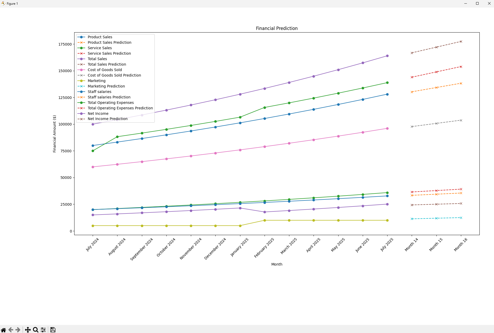

A small machine learning program utilizing Pandas and scikit-learn.

It reads data from a Google Sheet and uses Linear Regression to build a predictive model for future data.

The results are displayed in the screenshot below:

To run the program, you should generate the google cloud API credentials.json file.

Ask https://gemini.google.com/ for "how to download google cloud credentials.json file", it can give you correct steps for how to generate credentials.json file.

Replace your credentials.json file path in line 10 of the predict_future_data.py program.